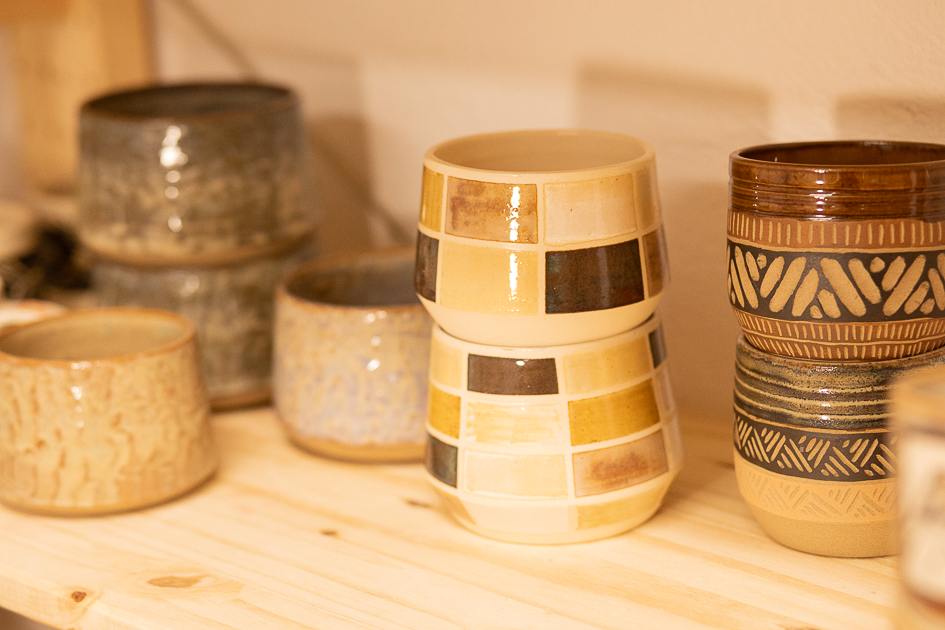

# Taller Inu — Sitio Web

Sitio web completo para **Taller Inu** / **Inu Ceramics** en Cuenca.

## 📁 Estructura de archivos

```
taller-inu/
├── index.html          ← Página principal (todo en un fichero)
├── css/
│   └── style.css       ← Todos los estilos
├── js/
│   └── main.js         ← Navegación, formularios, WhatsApp
├── images/             ← Carpeta para tus fotos (vacía)
└── README.md
```

## 🖼️ Cómo añadir fotos

Guarda tus fotos en la carpeta `images/` y descomenta las etiquetas `` en el HTML.

| Referencia en el HTML           | Qué poner                          |
|---------------------------------|------------------------------------|
| `images/hero.jpg`               | Foto de portada (inicio)           |
| `images/clases-card.jpg`        | Miniatura card "Clases Regulares"  |
| `images/experiencias-card.jpg`  | Miniatura card "Experiencias"      |
| `images/taller-header.jpg`      | Cabecera página El Taller          |
| `images/modelado.jpg`           | Foto clase modelado manual         |
| `images/exp-taza.jpg`           | Foto experiencia taza/bol          |
| `images/exp-sushi.jpg`          | Foto experiencia set sushi         |
| `images/carol.jpg`              | Tu foto (página Inu Ceramics)      |
| `images/producto-1.jpg` … `6`   | Fotos de tus piezas                |
| `images/og-image.jpg`           | Imagen para redes sociales (1200×630px) |

Para desactivar un placeholder y activar la foto real, busca la línea comentada justo encima del placeholder y quita los `<!-- -->`:

```html
<!--  -->   ← Quitar comentario
<div class="hero-img-placeholder">...             ← Borrar este bloque
```

## 📅 Cómo actualizar las fechas de experiencias

En `index.html`, busca las tablas con clase `dates-table`. Edita las filas:

```html
<tr>
  <td>15 julio 2025</td>
  <td>17:00</td>
  <td><span class="date-open">Plazas disponibles</span></td>
</tr>
```

Cuando se llene una fecha, cambia `date-open` por `date-full` y el texto a "Completo":

```html
<td><span class="date-full">Completo</span></td>
```

## 📞 Cambiar número de WhatsApp

En `js/main.js`, línea 7:

```js
const WA_NUMBER = '34604923916'; // ← Cambia aquí
```

## 🌐 Publicar en GitHub Pages

1. Crea un repositorio en GitHub (ej. `tallerinu`)
2. Sube la carpeta `taller-inu/` como raíz del repo
3. Ve a **Settings → Pages → Source: main branch / root (o /docs)**
4. Tu sitio estará en `https://tuusuario.github.io/tallerinu`

**Para dominio propio** (ej. `tallerinu.es`):
- En GitHub Pages, añade tu dominio en "Custom domain"
- En tu proveedor de dominio, apunta los DNS a GitHub Pages
- Actualiza la URL canónica en `index.html`: `<link rel="canonical" href="https://tallerinu.es/" />`
- Actualiza las URLs en los meta tags Open Graph

## 🔍 SEO incluido

- Meta description, keywords y author
- Open Graph para WhatsApp/redes sociales
- Twitter Card
- Geo tags para SEO local (Cuenca)
- Schema.org LocalBusiness (datos estructurados para Google)
- Canonical URL
- Accesibilidad: skip link, roles ARIA, alt en imágenes, aria-label

## ✏️ Personalización rápida

| Qué cambiar              | Dónde                                          |
|--------------------------|------------------------------------------------|
| Colores                  | Variables CSS en `:root` al inicio de `style.css` |
| Nombre del dominio       | Busca `tallerinu.es` en `index.html` y reemplaza |
| Añadir nueva experiencia | Copia el bloque `<article class="exp-card">` en `index.html` |
| Instagram handle         | Busca `@tallerinu` en `index.html`              |
